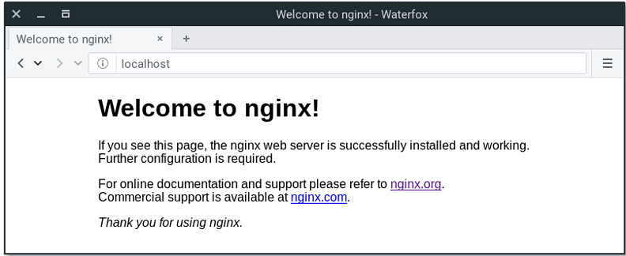

# Set Up Django with Postgres, Nginx, and Gunicorn on Ubuntu

### Introduction

Django is a powerful web framework that can help you get your Python application or website off the ground. Django includes a simplified development server for testing your code locally, but for anything even slightly production related, a more secure and powerful web server is required.

In this guide, you will install and configure some components on Ubuntu 22.04 (or any other supported Ubuntu version) to support and serve Django applications. You’ll configure the Gunicorn application server to interface with your applications. You will then set up Nginx to reverse proxy to Gunicorn, giving you access to its security and performance features to serve your apps.

You will be installing Django within a virtual environment. Installing Django into an environment specific to your project will allow your projects and their requirements to be handled separately.

Once you have your database and application up and running, you will install and configure the Gunicorn application server. This will serve as an interface to our application, translating client requests from HTTP to Python calls that our application can process. You will then set up Nginx in front of Gunicorn to take advantage of its high performance connection handling mechanisms and its easy-to-implement security features.

`Let’s get started`.


### Prerequisites

In order to complete this guide, you need a server running Ubuntu, along with a non-root user with sudo privileges and an active firewall. For guidance on how to set these up, please choose your distribution from this <a href="https://www.digitalocean.com/community/tutorial_collections/initial-server-setup"> list and follow our Initial Server Setup Guide </a>.

### Steps to Setup Django, Nginx & Gunicorn

1. Install the Packages from the Ubuntu Repositories
2. Create and activate a Python Virtual Environment
3. Create and Configure New Django Project
4. Complete Django Project Setup
5. Test Gunicorn’s Ability to Serve the Project
6. Creating Gunicorn systemd Socket and Service Files
7. Check Gunicorn Socket File
8. Testing Socket Activation
9. Configure Nginx to Proxy Pass to Gunicorn
10. Troubleshooting Nginx and Gunicorn

### Step 1 — Installing the Packages from the Ubuntu Repositories

#### To install Nginx, use following command <a href="https://ubuntu.com/tutorials/install-and-configure-nginx#2-installing-nginx">(source)</a>:

    sudo apt update
    sudo apt install nginx

After installing it, you already have everything you need. You can point your browser to your server IP address. You should see this page:



If you see this page, you have successfully installed Nginx on your web server.


### Step 2 — Creating a Python Virtual Environment for your Project
Create a directory `$ mkdir mysite` and change the directory `$ cd mysite`

    ../mysite$ python -m venv env
    ../mysite$ source env/bin/activate

Install Django, Gunicorn

    (env) ../mysite$ pip install django gunicorn==20.0.2

### Step 3 — Creating and Configuring a New Django Project

With your Python components installed, you can now create the actual Django project files.

Since you already have a project directory, you will tell Django to install the files here. It will create a second level directory with the actual code, which is normal, and place a management script in this directory. The key to this is that you are defining the directory explicitly instead of allowing Django to make decisions relative to our current directory:

    (env) ../mysite$ django-admin startproject mysite .

Create a application

    (env) ../mysite$ python manage.py startapp app


`mysite/mysite/settings.py`
```python
.....

DEBUG = False

ALLOWED_HOSTS = ["192.168.0.109", "*"]

...

INSTALLED_APPS = [
    ..,
    ...,
    "app",
]

...


STATIC_URL = "static/"
STATICFILES_DIRS = [
    Path.joinpath(BASE_DIR, "statics"),
]
STATIC_ROOT = BASE_DIR / "static"

# Media files (Images, File)
MEDIA_URL = "uploads/"
MEDIA_ROOT = BASE_DIR / "uploads"

```

`mysite/app/models.py`
```python
from django.db import models

# Create your models here.


class Image(models.Model):
    image = models.ImageField(upload_to="images")

```


`mysite/app/views.py`
```python
from django.shortcuts import render

from app.models import Image


def home(request):
    context = {"images": Image.objects.all()}
    return render(request, "index.html", context)

```


`mysite/app/urls.py`
```python
from django.urls import path

from .views import home

urlpatterns = [
    path(
        "",
        home,
        name="home",
    ),
]
```


`mysite/mysite/urls.py`
```python
from django.contrib import admin
from django.urls import path, include

urlpatterns = [
    path("admin/", admin.site.urls),
    path("", include("app.urls")),
]

```


`mysite/app/templates/index.html`
```html


<!DOCTYPE html>
<html lang="en">
<head>
    <meta charset="UTF-8">
    <meta name="viewport" content="width=device-width, initial-scale=1.0">
    <title>Document</title>
</head>
<body>
    <h1>Hello</h1>
    
    <h1>Static Image</h1> <br>
    <br>

    <h1>Media data</h1> <br>


    
        <br><br><br>
    


</body>
</html>
```

### Step 4 — Completing Initial Project Setup

Now, you can migrate the initial database schema to our Sqlite database using the management script:

    (env) ../mysite$ python manage.py makemigrations
    (env) ../mysite$ pythonmanage.py migrate

Create an administrative user for the project by typing:

    (env) ../mysite$ python manage.py createsuperuser

Now project file structure

```bash
.
├── app
│   ├── admin.py
│   ├── apps.py
│   ├── __init__.py
│   ├── migrations/
│   ├── models.py
│   ├── templates
│   │   └── index.html
│   ├── tests.py
│   ├── urls.py
│   └── views.py
├── db.sqlite3
├── manage.py
├── mysite
│   ├── asgi.py
│   ├── __init__.py
│   ├── settings.py
│   ├── urls.py
│   └── wsgi.py
└── statics
    └── app
        └── images
            └── wallpaperflare.jpg

```


You can collect all of the static content into the directory location that you configured by typing:

    (env) ../mysite$ python manage.py collectstatic

After collect static files project file structure

```bash
.
├── app
│   ├── admin.py
│   ├── apps.py
│   ├── __init__.py
│   ├── migrations/
│   ├── models.py
│   ├── templates
│   │   └── index.html
│   ├── tests.py
│   ├── urls.py
│   └── views.py
├── db.sqlite3
├── manage.py
├── mysite
│   ├── asgi.py
│   ├── __init__.py
│   ├── settings.py
│   ├── urls.py
│   └── wsgi.py
├── README.md
├── static
│   ├── admin/
│   └── app
│       └── images
│           └── wallpaperflare.jpg
└── statics
    └── app
        └── images
            └── wallpaperflare.jpg
```

You will have to confirm the operation. The static files will then be placed in a directory called `static` within your project directory.

If you followed the initial server setup guide, you should have a UFW firewall protecting your server. In order to test the development server, you need to allow access to the port you’ll be using.

Create an exception for port 8000 by typing:

    (env) ../mysite$ sudo ufw allow 8000

Finally, you can test out your project by starting up the Django development server with this command:

    (env) ../mysite$ manage.py runserver 0.0.0.0:8000


### Step 5 — Testing Gunicorn’s Ability to Serve the Project

The last thing you need to do before leaving your virtual environment is test Gunicorn to make sure that it can serve the application. You can do this by entering the project directory and using gunicorn to load the project’s WSGI module:

    (env) ../mysite$ gunicorn --bind 0.0.0.0:8000 mysite.wsgi

This will start Gunicorn on the same interface that the Django development server was running on. You can go back and test the app again in your browser.

`Note`: `The admin interface will not have any of the styling applied since Gunicorn does not know how to find the static CSS content responsible for this.`

You passed Gunicorn a module by specifying the relative directory path to Django’s wsgi.py file, which is the entry point to your application, using Python’s module syntax. Inside of this file, a function called application is defined, which is used to communicate with the application.

When you are finished testing, hit `CTRL-C` in the terminal window to stop Gunicorn.

You’re now finished configuring your Django application. You can back out of our virtual environment by typing:

    (env) ../mysite$ deactivate

The virtual environment indicator in your prompt will be removed.


### Step 6 — Creating systemd Socket and Service Files for Gunicorn

You have tested that Gunicorn can interact with our Django application, but you should now implement a more robust way of starting and stopping the application server. To accomplish this, you’ll make systemd service and socket files.

The Gunicorn socket will be created at boot and will listen for connections. When a connection occurs, systemd will automatically start the Gunicorn process to handle the connection.

Start by creating and opening a systemd socket file for Gunicorn with sudo privileges:
 
    ../mysite$ sudo nano /etc/systemd/system/gunicorn.socket

Inside, you will create a `[Unit]` section to describe the socket, a `[Socket]` section to define the socket location, and an `[Install]` section to make sure the socket is created at the right time:

```bash
[Unit]
Description=gunicorn socket

[Socket]
ListenStream=/run/gunicorn.sock

[Install]
WantedBy=sockets.target
```

Save and close the file when you are finished.

Next, create and open a systemd service file for Gunicorn with sudo privileges in your text editor. The service filename should match the socket filename with the exception of the extension:

    ../mysite$ sudo nano /etc/systemd/system/gunicorn.service

Start with the `[Unit]` section, which is used to specify metadata and dependencies. Put a description of the service here and tell the init system to only start this after the networking target has been reached. Because your service relies on the socket from the socket file, you need to include a `Requires` directive to indicate that relationship:

```bash
[Unit]
Description=gunicorn daemon
Requires=gunicorn.socket
After=network.target
```

Next, you’ll open up the `[Service]` section. Specify the user and group that you want to process to run under. You will give your regular user account ownership of the process since it owns all of the relevant files. You’ll give group ownership to the www-data group so that Nginx can communicate easily with Gunicorn.

Then you’ll map out the working directory and specify the command to use to start the service. In this case, you have to specify the full path to the Gunicorn executable, which is installed within our virtual environment. You will then bind the process to the Unix socket you created within the /run directory so that the process can communicate with Nginx. You log all data to standard output so that the journald process can collect the Gunicorn logs. You can also specify any optional Gunicorn tweaks here. For example, you specified 3 worker processes in this case:

```bash
[Unit]
Description=gunicorn daemon
Requires=gunicorn.socket
After=network.target

[Service]
User=partho
Group=www-data
WorkingDirectory=/home/partho/Desktop/Newfolder/mysite
ExecStart=/home/partho/Desktop/Newfolder/mysite/env/bin/gunicorn \
          --access-logfile - \
          --workers 3 \
          --bind unix:/run/gunicorn.sock \
          mysite.wsgi:application

```

Finally, you’ll add an `[Install]` section. This will tell systemd what to link this service to if you enable it to start at boot. You want this service to start when the regular multi-user system is up and running:

```bash
[Unit]
Description=gunicorn daemon
Requires=gunicorn.socket
After=network.target

[Service]
User=partho
Group=www-data
WorkingDirectory=/home/partho/Desktop/Newfolder/mysite
ExecStart=/home/partho/Desktop/Newfolder/mysite/env/bin/gunicorn \
          --access-logfile - \
          --workers 3 \
          --bind unix:/run/gunicorn.sock \
          mysite.wsgi:application

[Install]
WantedBy=multi-user.target
```


With that, your systemd service file is complete. Save and close it now.

You can now start and enable the Gunicorn socket. This will create the socket file at `/run/gunicorn.sock` now and at boot. When a connection is made to that socket, systemd will automatically start the `gunicorn.service` to handle it:

    ../mysite$ sudo systemctl start gunicorn.socket
    ../mysite$ sudo systemctl enable gunicorn.socket

You can confirm that the operation was successful by checking for the socket file.

### Step 7 — Checking for the Gunicorn Socket File

Check the status of the process to find out whether it was able to start:

    ../mysite$ sudo systemctl status gunicorn.socket

You should receive an output like this:

```Output```
```bash
● gunicorn.socket - gunicorn socket
     Loaded: loaded (/etc/systemd/system/gunicorn.socket; enabled; vendor preset: enabled)
     Active: active (running) since Sat 2024-03-23 10:30:36 +06; 1h 51min ago
   Triggers: ● gunicorn.service
     Listen: /run/gunicorn.sock (Stream)
     CGroup: /system.slice/gunicorn.socket
```

Next, check for the existence of the `gunicorn.sock` file within the `/run` directory:

    ../mysite$ file /run/gunicorn.sock

```Output```

```bash
/run/gunicorn.sock: socket
```

If the `systemctl status` command indicated that an error occurred or if you do not find the `gunicorn.sock` file in the directory, it’s an indication that the Gunicorn socket was not able to be created correctly. Check the Gunicorn socket’s logs by typing:

    ../mysite$ sudo journalctl -u gunicorn.socket

Take another look at your `/etc/systemd/system/gunicorn.socket` file to fix any problems before continuing.

### Step 8 — Testing Socket Activation

Currently, if you’ve only started the `gunicorn.socket` unit, the `gunicorn.service` will not be active yet since the socket has not yet received any connections. You can check this by typing:

```Output```
```bash
● gunicorn.service - gunicorn daemon
     Loaded: loaded (/etc/systemd/system/gunicorn.service; disabled; vendor preset: enabled)
     Active: inactive (dead)
TriggeredBy: ● gunicorn.socket
```

To test the socket activation mechanism, you can send a connection to the socket through curl by typing:

    ../mysite$ curl --unix-socket /run/gunicorn.sock localhost

You should receive the HTML output from your application in the terminal. This indicates that Gunicorn was started and was able to serve your Django application. You can verify that the Gunicorn service is running by typing:

    ../mysite$ sudo systemctl status gunicorn

```Output```
```bash
● gunicorn.service - gunicorn daemon
     Loaded: loaded (/etc/systemd/system/gunicorn.service; disabled; vendor preset: enabled)
     Active: active (running) since Sat 2024-03-23 10:34:35 +06; 1h 57min ago
TriggeredBy: ● gunicorn.socket
   Main PID: 13375 (gunicorn)
      Tasks: 4 (limit: 13994)
     Memory: 97.2M
        CPU: 2.419s
     CGroup: /system.slice/gunicorn.service
             ├─13375 /home/partho/Desktop/Newfolder/mysite/env/bin/python3 /home/partho/Desktop/Newfolder/mysite/env/bin/gunicorn --access-logfile - --workers 3 --bind unix:/run/gunicorn.sock mysite.>
             ├─13398 /home/partho/Desktop/Newfolder/mysite/env/bin/python3 /home/partho/Desktop/Newfolder/mysite/env/bin/gunicorn --access-logfile - --workers 3 --bind unix:/run/gunicorn.sock mysite.>
             ├─13399 /home/partho/Desktop/Newfolder/mysite/env/bin/python3 /home/partho/Desktop/Newfolder/mysite/env/bin/gunicorn --access-logfile - --workers 3 --bind unix:/run/gunicorn.sock mysite.>
             └─13400 /home/partho/Desktop/Newfolder/mysite/env/bin/python3 /home/partho/Desktop/Newfolder/mysite/env/bin/gunicorn --access-logfile - --workers 3 --bind unix:/run/gunicorn.sock mysite.>

মার্চ 23 10:34:35 partho gunicorn[13400]: [2024-03-23 10:34:35 +0600] [13400] [INFO] Booting worker with pid: 13400
মার্চ 23 10:34:35 partho gunicorn[13398]:  - - [23/Mar/2024:04:34:35 +0000] "GET / HTTP/1.0" 200 722 "-" "Mozilla/5.0 (X11; Ubuntu; Linux x86_64; rv:123.0) Gecko/20100101 Firefox/123.0"
মার্চ 23 10:34:36 partho gunicorn[13399]:  - - [23/Mar/2024:04:34:36 +0000] "GET / HTTP/1.0" 200 722 "-" "Mozilla/5.0 (X11; Ubuntu; Linux x86_64; rv:123.0) Gecko/20100101 Firefox/123.0"
মার্চ 23 10:34:36 partho gunicorn[13400]:  - - [23/Mar/2024:04:34:36 +0000] "GET / HTTP/1.0" 200 722 "-" "Mozilla/5.0 (X11; Ubuntu; Linux x86_64; rv:123.0) Gecko/20100101 Firefox/123.0"
মার্চ 23 10:34:37 partho gunicorn[13400]:  - - [23/Mar/2024:04:34:37 +0000] "GET / HTTP/1.0" 200 722 "-" "Mozilla/5.0 (X11; Ubuntu; Linux x86_64; rv:123.0) Gecko/20100101 Firefox/123.0"
মার্চ 23 10:34:37 partho gunicorn[13400]:  - - [23/Mar/2024:04:34:37 +0000] "GET / HTTP/1.0" 200 722 "-" "Mozilla/5.0 (X11; Ubuntu; Linux x86_64; rv:123.0) Gecko/20100101 Firefox/123.0"
মার্চ 23 10:34:38 partho gunicorn[13400]:  - - [23/Mar/2024:04:34:38 +0000] "GET / HTTP/1.0" 200 722 "-" "Mozilla/5.0 (X11; Ubuntu; Linux x86_64; rv:123.0) Gecko/20100101 Firefox/123.0"
মার্চ 23 10:34:38 partho gunicorn[13400]:  - - [23/Mar/2024:04:34:38 +0000] "GET / HTTP/1.0" 200 722 "-" "Mozilla/5.0 (X11; Ubuntu; Linux x86_64; rv:123.0) Gecko/20100101 Firefox/123.0"
মার্চ 23 10:34:38 partho gunicorn[13398]:  - - [23/Mar/2024:04:34:38 +0000] "GET / HTTP/1.0" 200 722 "-" "Mozilla/5.0 (X11; Ubuntu; Linux x86_64; rv:123.0) Gecko/20100101 Firefox/123.0"
মার্চ 23 10:34:38 partho gunicorn[13399]:  - - [23/Mar/2024:04:34:38 +0000] "GET / HTTP/1.0" 200 722 "-" "Mozilla/5.0 (X11; Ubuntu; Linux x86_64; rv:123.0) Gecko/20100101 Firefox/123.0"
```

If the output from curl or the output of `systemctl status` indicates that a problem occurred, check the logs for additional details:

    ../mysite$ sudo journalctl -u gunicorn


Check your `/etc/systemd/system/gunicorn.service` file for problems. If you make changes to the `/etc/systemd/system/gunicorn.service` file, reload the daemon to reread the service definition and restart the Gunicorn process by typing:

    ../mysite$ sudo systemctl daemon-reload
    ../mysite$ sudo systemctl restart gunicorn

Make sure you troubleshoot the above issues before continuing.


### Step 10 — Configure Nginx to Proxy Pass to Gunicorn

Now that Gunicorn is set up, you need to configure Nginx to pass traffic to the process.

Start by creating and opening a new server block in Nginx’s sites-available directory:

    ../mysite$ sudo nano /etc/nginx/sites-available/mysite

Inside, open up a new server block. You will start by specifying that this block should listen on the normal port 80 and that it should respond to your server’s domain name or IP address:

```bash
server {
    listen 80;
    server_name 192.168.0.109;
}
```

Next, you will tell Nginx to ignore any problems with finding a favicon. You will also tell it where to find the static assets that you collected in your `/home/partho/Desktop/Newfolder/mysite/static` directory same as media file. All of these files have a standard URI prefix of `“/static”`, so you can create a location block to match those requests:

```bash
server {
    listen 80;
    server_name 192.168.0.109;

    location = /favicon.ico { access_log off; log_not_found off; }
    location /static/ {
        root /home/partho/Desktop/Newfolder/mysite/ ;
    }

    location /uploads/ {
        root /home/partho/Desktop/Newfolder/mysite/ ;
    }
}

```

Finally, create a `location / {}` block to match all other requests. Inside of this location, you’ll include the standard `proxy_params` file included with the Nginx installation and then pass the traffic directly to the Gunicorn socket:

```bash
server {
    listen 80;
    server_name 192.168.0.109;

    location = /favicon.ico { access_log off; log_not_found off; }
    location /static/ {
        root /home/partho/Desktop/Newfolder/mysite/ ;
    }

    location /uploads/ {
        root /home/partho/Desktop/Newfolder/mysite/ ;
    }

    location / {
        include proxy_params;
        proxy_pass http://unix:/run/gunicorn.sock;
    }
}
```

Save and close the file when you are finished. Now, you can enable the file by linking it to the sites-enabled directory:

    ../mysite$ sudo ln -s /etc/nginx/sites-available/mysite /etc/nginx/sites-enabled

Check if the Symbolic Link Exists:

You can verify if the symbolic link already exists by running the following command:

    ../mysite$ ls -l /etc/nginx/sites-enabled

```Output``
```bash
total 0
lrwxrwxrwx 1 root root 34 মার্চ     19 22:01 default -> /etc/nginx/sites-available/default
lrwxrwxrwx 1 root root 33 মার্চ     23 00:11 mysite -> /etc/nginx/sites-available/mysite
```

Remove or Backup Existing File:

If there's an existing file named mysite in `/etc/nginx/sites-enabled`, you can either remove it or rename it to something else to avoid conflicts:

    ../mysite$ sudo rm /etc/nginx/sites-enabled/mysite


Test your Nginx configuration for syntax errors by typing:

    ../mysite$ sudo nginx -t

If no errors are reported, go ahead and restart Nginx by typing:

    ../mysite$ sudo systemctl restart nginx

Finally, you need to open up your firewall to normal traffic on port 80. Since you no longer need access to the development server, you can remove the rule to open port 8000 as well:

    ../mysite$ sudo ufw delete allow 8000
    ../mysite$ sudo ufw allow 'Nginx Full'

You should now be able to go to your server’s domain or IP address to view your application.

`Note`: After configuring Nginx, the next step should be securing traffic to the server using SSL/TLS. This is important because without it, all information, including passwords are sent over the network in plain text.

If you have a domain name, the easiest way to get an SSL certificate to secure your traffic is using Let’s Encrypt. Follow this guide for 
<a href="https://www.digitalocean.com/community/tutorials/how-to-secure-nginx-with-let-s-encrypt-on-ubuntu-22-04"> Ubuntu 22.04 </a> / 
<a href="https://www.digitalocean.com/community/tutorials/how-to-secure-apache-with-let-s-encrypt-on-ubuntu-20-04"> Ubuntu 20.04 </a> / <a href="https://www.digitalocean.com/community/tutorials/how-to-secure-apache-with-let-s-encrypt-on-ubuntu-18-04"> Ubuntu 18.04 </a> to set up Let’s Encrypt with Nginx on Ubuntu 22.04. Follow the procedure using the Nginx server block you created in this guide.


### Step 10 — Troubleshooting Nginx and Gunicorn

If this last step does not show your application, you will need to troubleshoot your installation

#### Nginx Is Showing the Default Page Instead of the Django Application

If Nginx displays the default page instead of proxying to your application, it usually means that you need to adjust the `server_name` within the `/etc/nginx/sites-available/mysite` file to point to your server’s IP address or domain name.

Nginx uses the `server_name` to determine which server block to use to respond to requests. If you receive the default Nginx page, it is a sign that Nginx wasn’t able to match the request to a sever block explicitly, so it’s falling back on the default block defined in `/etc/nginx/sites-available/default`.

The `server_name` in your project’s server block must be more specific than the one in the default server block to be selected.

#### Nginx Is Displaying a 502 Bad Gateway Error Instead of the Django Application

A 502 error indicates that Nginx is unable to successfully proxy the request. A wide range of configuration problems express themselves with a 502 error, so more information is required to troubleshoot properly.

The primary place to look for more information is in Nginx’s error logs. Generally, this will tell you what conditions caused problems during the proxying event. Follow the Nginx error logs by typing:

    ../mysite$ sudo tail -F /var/log/nginx/error.log

Now, make another request in your browser to generate a fresh error (try refreshing the page). You should receive a fresh error message written to the log. If you look at the message, it should help you narrow down the problem.

You might receive the following message:

```bash
connect() to unix:/run/gunicorn.sock failed (2: No such file or directory)
```

This indicates that Nginx was unable to find the gunicorn.sock file at the given location. You should compare the `proxy_pass` location defined within `/etc/nginx/sites-available/mysite` file to the actual location of the `gunicorn.sock` file generated by the `gunicorn.socket` systemd unit.

If you cannot find a `gunicorn.sock` file within the `/run` directory, it generally means that the systemd socket file was unable to create it. Go back to the <b>section on checking for the Gunicorn socket file</b> to step through the troubleshooting steps for Gunicorn.

```bash
connect() to unix:/run/gunicorn.sock failed (13: Permission denied)
```
This indicates that Nginx was unable to connect to the Gunicorn socket because of permissions problems. This can happen when the procedure is followed using the root user instead of a `sudo` user. While systemd is able to create the Gunicorn socket file, Nginx is unable to access it.

This can happen if there are limited permissions at any point between the root directory (`/`) the `gunicorn.sock` file. You can review the permissions and ownership values of the socket file and each of its parent directories by passing the absolute path to your socket file to the `namei` command:

    ../mysite$ namei -l /run/gunicorn.sock

`Output`
```bash
f: /run/gunicorn.sock
drwxr-xr-x root root /
drwxr-xr-x root root run
srw-rw-rw- root root gunicorn.sock
```

The output displays the permissions of each of the directory components. By looking at the permissions (first column), owner (second column) and group owner (third column), you can figure out what type of access is allowed to the socket file.

In the above example, the socket file and each of the directories leading up to the socket file have world read and execute permissions (the permissions column for the directories end with `r-x` instead of `---`). The Nginx process should be able to access the socket successfully.

If any of the directories leading up to the socket do not have world read and execute permission, Nginx will not be able to access the socket without allowing world read and execute permissions or making sure group ownership is given to a group that Nginx is a part of.

